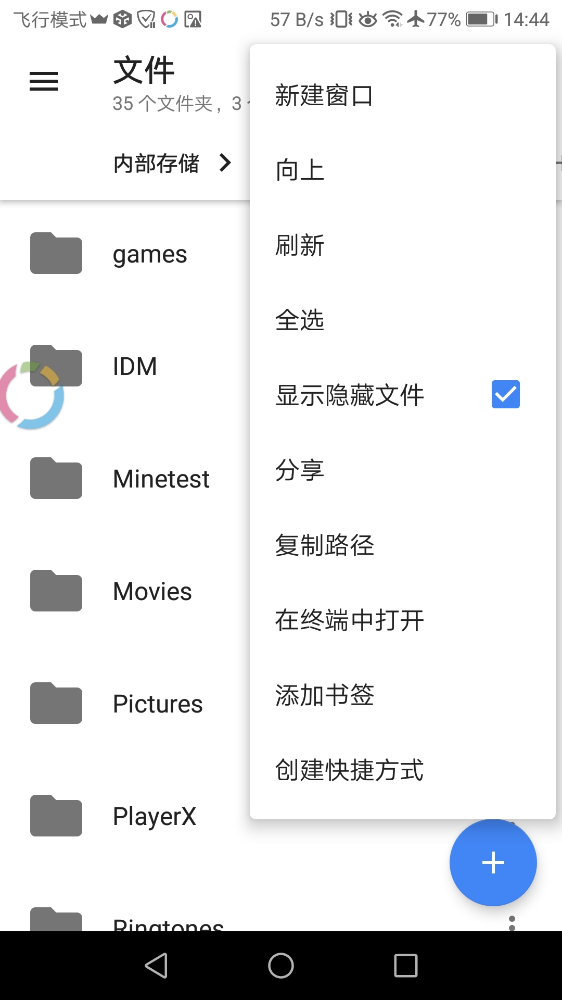

  #  Minecraft Java 导入地图教程
  
  
  1、下载安卓Minecraft Java版。[PojavLauncher](https://github.com/PojavLauncherTeam/PojavLauncher/releases)
  
  2、打开[PojavLauncher](PojavLauncher)选择地图对于的版本、启动游戏。
  
  
  3、下载地图[planetminecraft](https://www.planetminecraft.com/project/novigrad-timelapse-download/) 
  
  4、下载、[Material Files](https://f-droid.org/en/packages/me.zhanghai.android.files/)
  
  5、打开、Material Files 点击上面角落的┇  点击显示隐藏文件。
  
  
  
  6、使用Material Files把下载好的地图解压到 内部存储 games/PojavLauncher/.minecraft/saves/
  
  7、启动游戏、点击单人游戏、就可以看到你导入地图了。
  
  8、进入导入地图后，在空中什么都没有，你需要关闭飞行模式掉落到地面。
  
  
  
  
  
  
  
  ## [创建服务器].(https://cuberite.org/）
  
  ## 模组 
  https://dev.bukkit.org/
  https://www.curseforge.com/
  https://www.minecraft-schematics.com/
  https://forums.minecraftforge.net/
  
  
  ## Minecraft 世界编辑器
https://www.worldpainter.net/
https://github.com/topics/minecraft
https://github.com/collections/hacking-minecraft
https://www.realtimerendering.com/erich/minecraft/public/mineways/

## Minecraft 3D图形导出
https://minecraft.gamepedia.com/Programs_and_editors/3D_exporters
https://www.world-machine.com/
https://github.com/jmc2obj/j-mc-2-obj

## Minecraft 版本
https://minecraft-inside.ru/
https://files.minecraftforge.net/
https://tlauncher.org/en/

## Minecraft 博客
https://www.minethatcraft.com/
https://minecraftbuildinginc.com/
https://pcminecraft-mods.com/tag/adventure-maps-for-minecraft/

  
  
# 
  ## Minecraft Python 教程
  https://imgchr.com/album/BKW6K

## Minecraft Python 书籍
https://www.wiley.com/en-gb/Adventures+In+-c-7732
https://www.wiley.com/WileyCDA/Section/id-823690.html

#
#
#
#

### Minetest
[https://www.minetest.net/](https://www.minetest.cn/)

### Minetest Python 版
https://github.com/sprintingkiwi/pycraft_mod

### Minetest 教程
https://wap.tljpxm.com/app/faxianshow.jsp?id=1776482

# /grantme all 给自己全部特权。
# /grant 玩家名称 fly给指定玩家特权、或/grant 玩家名称 all
# /teleport 玩家名称 或者坐标/teleport (x,y,z)瞬间移动
# /time 21:00 时间设置、
# all     表示全部
# fly     表示飞行
# noclip  表示穿墙透视
# fast    表示快速移动
# 指今：https://wiki.minetest.net/Privileges
# 服务器指令：https://wiki.minetest.net/Server_commands

#
#
#
#
#

###    替代品

##  翻译功能浏览器
Yandex

##  种子bt下载
https://github.com/c0re100/qBittorrent-Enhanced-Edition/releases

安卓版https://github.com/proninyaroslav/libretorrent

##  垃圾百度 
多吉搜索https://dogedoge.com/
#
GOOBE https://goobe.io/
#
秘迹搜索https://mijisou.com/
#
LESO乐搜https://www.leso.ml/
#
萌搜https://mengso.com/
#
Magi搜索https://magi.com
#
#
#
### 游戏商店

[gamebanana](https://gamebanana.com/)

[overwolf](https://www.overwolf.com/)

[steam](https://store.steampowered.com/app/550650/Black_Squad/)

[games](https://store.my.games/)

[lutris](https://lutris.net/games/)

#
#
## 录视频

[obs](https://obsproject.com/)

## 视频播放器

[mpv](https://mpv.io/)

[kmplayer](https://en.kmplayer.com/)

[PotPlayer](https://potplayer.daum.net/)

[jellyfin](https://jellyfin.org/)

## bt播放器

[Soda Player](https://www.sodaplayer.com/)

[powder.media](https://powder.media/)

[webtorrent](https://webtorrent.io/)

[安卓](https://m.shouji.com.cn/down/174886.html)

## 杀毒软件

[malwarebytes](https://www.malwarebytes.com/)

[superantispyware](https://www.superantispyware.com/free-edition.html)

[bitdefender](https://www.bitdefender.com/solutions/free.html)

[comodo](https://www.comodo.com/?af=7639)

[ikarussecurity](https://www.ikarussecurity.com/en/sdks-and-apis/ikarus-scan-engine/)

[avast](https://www.avast.com/zh-cn/free-antivirus-download)

[avira](https://www.avira.com/zh-cn/free-antivirus)

安卓[Anti-virus Dr.Web Light](https://play.google.com/store/apps/details?id=com.drweb&hl=en_US&gl=US)

安卓[AdGuard](https://m.shouji.com.cn/down/31270.html)

## 免费无限容量网盘github

上传文件大小限制2GB

不限速

注册要用手机号接收验证码

https://www.dogedoge.com/results?q=%E5%85%8D%E8%B4%B9%E6%8E%A5%E7%9F%AD%E4%BF%A1

注册后创建，公有仓库，或私有仓库。

然后点Releases上传文件就可以。

视频类文件，建议用密码压缩后再上传。

建议使用标准的压缩软件，不使用标准的压缩软件压缩，会出现解压失败，文件就废了。

Android：ZArchiver 

Win10： 7-Zip

下载建议用多线程下载工具，

Win10：Neat Download Manager 1.2

Android：IDM+
