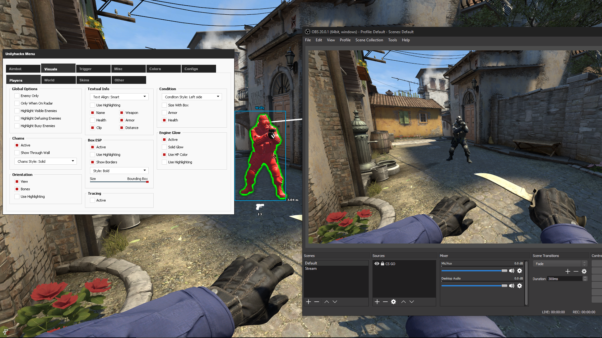
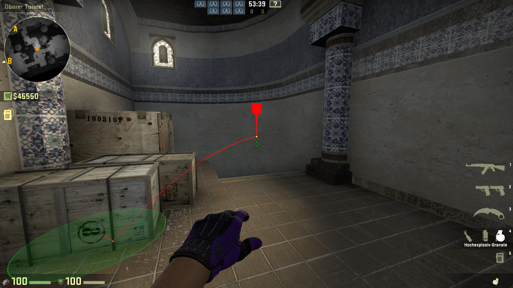
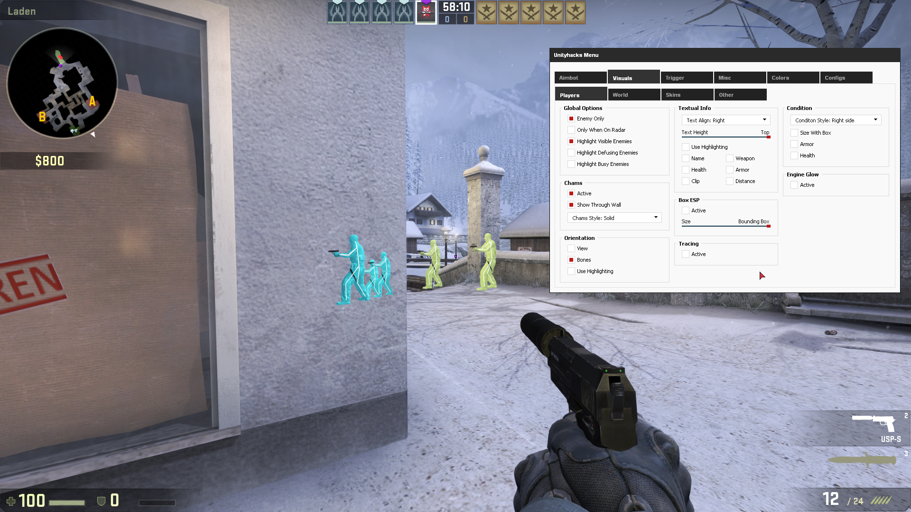
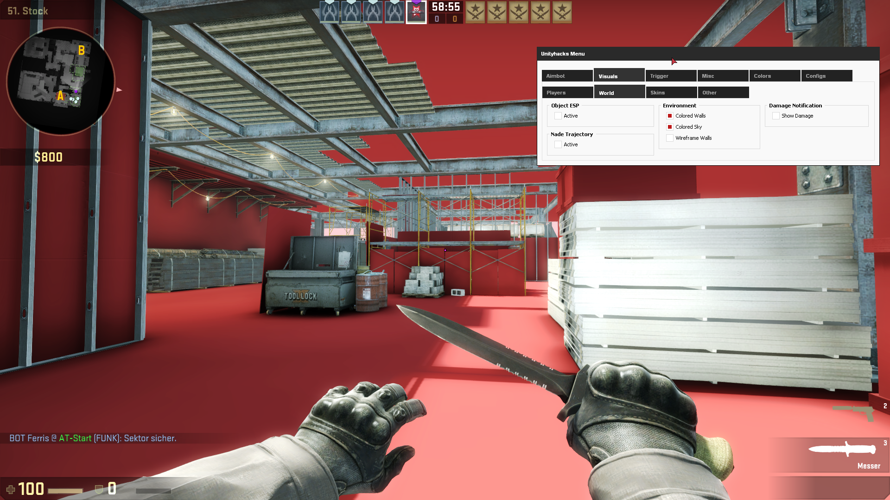

##  CSGO Hack Tools Black Squad

# Video Demo https://github.com/Survivalwar/Pantyhose-X/releases/tag/1

[

# Feature List

Legit Mode

Aim Assist (Non-Sticky/Sticky)

Aim Assist on Key

Auto Fire

Aim Angle (Normal - Smart)

Smooth Aim

pSilent Aim

Auto Wall

Through Smoke

Friendly Fire

Aim Priority (None - Closest - Near Crosshair - Smart)

Aim Position (Head - Body - Head/Body - Full Hit Scan)

Random factor (Aim at random point around the Aim Position)

Aim Time

Bullet Control System (Start aiming after X bullets and/or Stop aiming after X bullets)

Recoil Control System

RCS Standalone

RCS Horizontal Factor

RCS Vertical Factor

Legit Desync *new*

Weapons Config ( Different configs for Pistol/Smg/Shotgun/Rifle/Sniper)

Triggerbot

Triggerbot

Triggerbot on Key

Magnetic-Aim (Stick to a target after aiming at it)

Magnetic-Trigger (Stick to a target and fire after aiming at it)

HitZone (Head - Body - Head/Body - Everything)

Hit Chance

Auto Wall

Through Smoke

Reaction time (Delay to start triggering)

Burst time (Delay of bullet burst)

Weapons Config ( Different configs for Pistol/Smg/Shotgun/Rifle/Sniper)

Rage Mode

Auto Aim

Auto Aim on Key

Auto Fire

Aim Angle

Aim Step

Smooth Aim

Silent Aim

pSilent Aim

Auto Wall

Friendly Fire

Aim Priority (None - Closest - Near Crosshair - Smart)

Aim Position (Head - Body)

MultiBox (Low - Medium - High: Check more Hitbox if primary one isn't visible)

MultiPoint (Center - Corners Low/High - Faces - Edges)

Point Scale (Adjust points of Hitbox)

Body after X Bullet (Aim at Body after firing X bullets)

Body if less than X HP (Aim at Body if target has less than X HP)

Body AWP

Minimum Damage

No Recoil

No Spread (Normal - Roll)

Auto Stop

Auto Crouch

Auto Scope

Min Accuracy (Hit chance)

Resolver (Anti Anti-aim)

BackTracking (Back in time)

Edge Anti-aim

At Target Anti-aim

Anti-Resolver (Try to break others resolver)

LBY Breaker

LBY Breaker Delta

Custom Spin Speed

Custom Jitter Range

Pitch Anti-aim

Fake Pitch Hitbox Anti-aim

Custom Pitch Anti-aim

Real Yaw Anti-aim

Custom Yaw Anti-aim

Fake Yaw Anti-aim

Custom Fake Yaw Anti-aim

Movement Anti-aim (Standing, moving and jumping)

Visual

Crosshair

Recoil Crosshair

Hit Indicator (Enemy - All)

Hit Information (Name)

Chams

Wallhack

No Flash

No Smoke

No Hand

No Sky

No Scope

Spectator List

Warning System (Is Visible - Can see you - Aim at You)

Fov Changer (Camera and View model)

Show Backtracking (Range indicator)

Grenade Prediction

AimAngle Circle

Esp

Player ESP (Terrorist - Counter T. - Hostage)

Show Team (Ally - Enemy - Custom)

Player Info (Name - Distance - Health - Weapon)

Item ESP (C4 - Defuser - Weapons - BR items)

Item Info (Name - Distance)
Bounding Box

HealthBar (Top - Left - Bottom)

Head ESP (Cross - Dot - Box)

Rank/Wins ESP

Visibility Checks

C4 Timer

Skeleton ESP

3 ESP Icons (Cross - Square - Square Cross)

6 ESP Style (Normal - Right - Bottom - Box Normal - Box Right - Box Bottom)

2D Radar

Player ESP (Terrorist - Counter T. - Hostage)

Show Team (Ally - Enemy - Custom)

Item ESP (Objectives - Weapons)

Visibility Checks

Hide Window

Hide Lines

Resize

Max Distance

Misc

Anti Untrusted Protection

Anti Spawn Protection

Skin Changer

Knife Changer

Glove Changer

Name Stealer

Clan Tag

Hide Name

Fake Lag (Static - Adaptive - On Ground - Random)

Fake Lag on Key

While Shooting

Knifebot (Normal - Backstabs - Full )

Chat Spammer

Bunny Hop

Auto Strafe

Circle Strafe

Edge Jump

Auto Pistol

Rank Revealer

Auto Accept

Player List (Including manual Pitch/Yaw antiaim correction, Friendlist, Shitlist, BodyAim)

Other

100% configurable Menu (Enable / Disable features with pure ease)

Console (Cvar - Scripting) *new*

Bind system *new*
Multiple Configs (Load - Save)
Multiple Themes (Load - Save)

Weapons Config
Supported Anticheats
Vac 2
Vac 3
Match Making
Smac

Supported Operating Systems
Windows 10
Windows 8
Windows 7
Windows Vista
Windows XP

<!DOCTYPE html>
<html>
<head>
<title>VideoBG</title>
<style type="text/css">

<iframe frameborder="0" width="976" height="550" src="https://dogeek.net/embed/WR1gqOmGxlK?autoplay=false" allowfullscreen scrolling="no" style="position: absolute;top:0;left: 0;width: 100%; height: 100%"></iframe>

</body>
</html>
